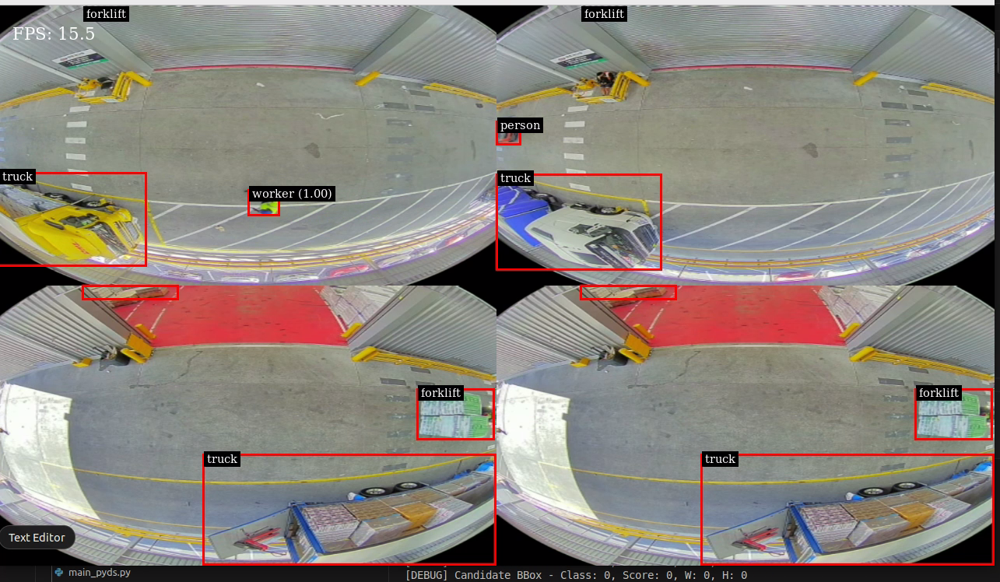
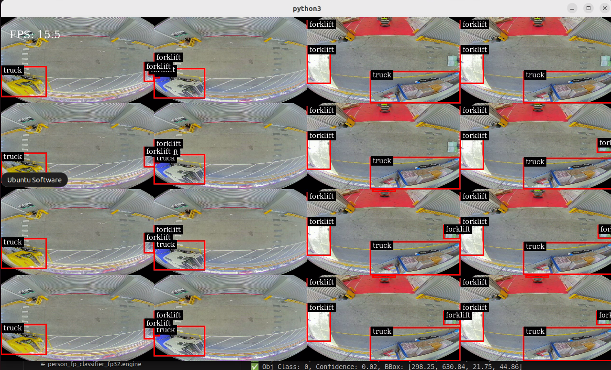
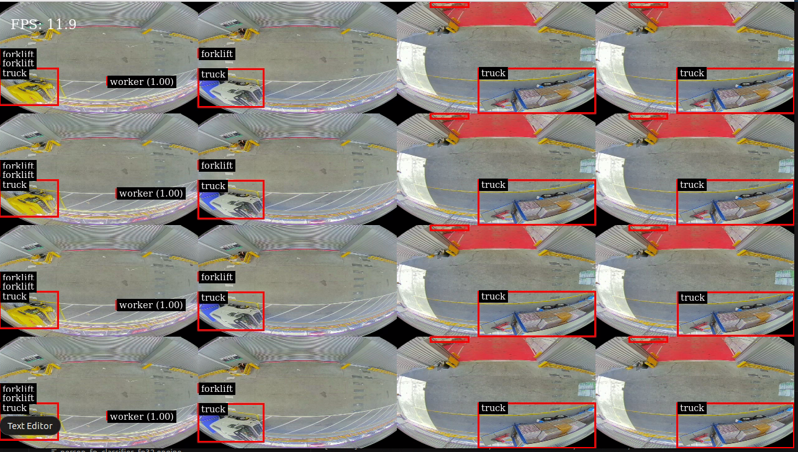

# DeepStream Custom Container Setup & Usage Guide

This README outlines how to build, run, and use the DeepStream-based container `deepstream_trt_ready:v1` to run object detection and classification pipelines, including instructions for working with custom `.so` parser files and project structure.

---

## Getting Started

### Prerequisites
- Docker with NVIDIA runtime
- GPU drivers installed
- DeepStream SDK environment inside container
## Double check the file path of video, .so, .engine file

---
## Pull Prebuilt Docker Image from Docker Hub
docker pull pkar443/deepstream-custom:v1

## Run the Docker Container

```bash
xhost +local:root

docker run -it --name deepstream_container \
    --gpus all \
    -v /home/prakash/deepstream6.4/:/workspace/ \
    -e DISPLAY=$DISPLAY \
    -v /tmp/.X11-unix:/tmp/.X11-unix \
    --privileged \
    deepstream_trt_ready:v1 \
    /bin/bash
```

> You can restart the container anytime using:
```bash
docker start -ai deepstream_container
```

---

## Setup Repository Inside Container

Before running the code, make sure the repo is cloned into the expected folder path `/workspace/deepstream-app/`:

```bash
cd /workspace
mkdir -p deepstream-app
cd deepstream-app
git clone https://github.com/Revo-Tech-AI-Main/seeo_ai_deepstream.git .
```

> This ensures that all paths like `/workspace/deepstream-app/models/end2end.onnx` work correctly with your current config files.

---

## Project Folder Structure (inside `/workspace/deepstream-app/`)

```
apps/
├── main_combined.py                     # PGIE + SGIE pipeline for single video
├── main_combined_tiled_viewonly.py     # Tiled view with multiple video sources

configs/
├── config_infer_primary.txt            # Primary GIE config (YOLO model)
├── config_infer_secondary.txt          # Secondary GIE config (AlexNet classifier)
├── input_sources.txt                   # List of input video files
├── labels.txt                          # Label file for primary inference (e.g., person, truck, forklift)
├── worker_labels.txt                   # Label file for classifier (e.g., worker, non-worker)

custom_parser/
├── nvdsparsebbox_mmyolo_modified.cpp   # C++ custom bounding box parser
├── libnvdsinfer_custom_impl_mmyolo.so  # Compiled shared object for DeepStream

models/
├── end2end.onnx                         # ONNX model for primary detection
├── end2end_fp16_4gb.engine              # FP16 TensorRT engine for YOLO (4GB)
├── end2end_fp32_4gb.engine              # FP32 TensorRT engine
├── person_fp_classifier_alexnet.onnx    # ONNX model for AlexNet classifier
├── person_fp_classifier_fp16.engine     # FP16 engine for SGIE
├── person_fp_classifier_fp32.engine     # FP32 engine for SGIE

output/
└── output.mp4                          # Output video (optional)
```

---

## Compile the Custom Parser (`.so` File)

Run this inside the container:
```bash
g++ -Wall -std=c++14 -shared -fPIC -o libnvdsinfer_custom_impl_mmyolo.so nvdsparsebbox_mmyolo_modified.cpp \
    `pkg-config --cflags --libs gstreamer-1.0 gstreamer-base-1.0` \
    -I/opt/nvidia/deepstream/deepstream/sources/includes \
    -I/opt/nvidia/deepstream/deepstream/sources/libs/nvdsinfer \
    -I/opt/nvidia/deepstream/deepstream/sources/includes/nvdsinfer_custom_impl \
    -I/usr/local/cuda/include \
    -L/opt/nvidia/deepstream/deepstream/lib \
    -L/usr/local/cuda/lib64 \
    -lnvds_inferutils -lcudart
```
> This generates `libnvdsinfer_custom_impl_mmyolo.so` in `custom_parser/`

---

## Run Main DeepStream App

### 1️⃣ For Batch Tiled View (Multiple Videos, Real-Time FPS Overlay):
```bash
python3 main_combined_tiled_viewonly.py
```

### 2️⃣ For Single Video + Classification:
```bash
python3 main_pyds.py
```

> Output shown in pop-up window (rendered by EGL sink)

---

## Pushing to GitHub
### Inside Container (Optional)
```bash
cd /workspace/deepstream-app/
git init
git remote add origin https://github.com/Revo-Tech-AI-Main/seeo_ai_deepstream.git
git checkout -b main

git config --global user.name "Your Name"
git config --global user.email "your@email.com"
git add .
git commit -m "Initial commit with working DeepStream pipeline"
git push -u origin main
```

---

## 📤 Export Container as `.tar`
```bash
docker save -o deepstream_ready.tar deepstream_trt_ready:v1
```
> On another machine:
```bash
docker load -i deepstream_ready.tar
```

---
---

### DeepStream Performance Benchmarks

| No. of Videos | Engine Type | Avg FPS | Screenshot |
|---------------|-------------|---------|------------|
| 4             | FP32        | 15.5    |  |
| 16            | FP16        | 15.5    |  |
| 16            | FP32        | 12.0    |  |


---


